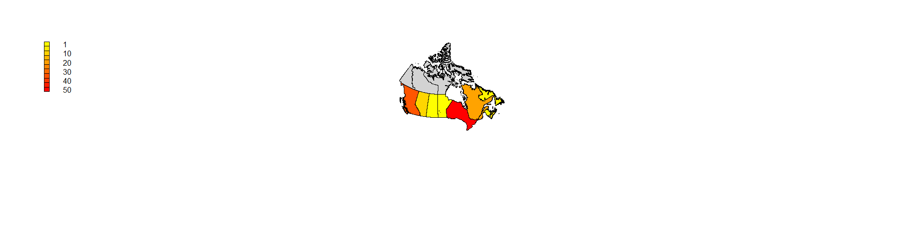

SWC/DC Workshops in Canada
================

Motivation
----------

My goal in joining the Carpentries mentorship group is to help in community building in Canada. In particular, I would like to increase both geographical and institutional diversity of Software Carpentry and Data Carpentry workshops. I thought it might be useful to look at the locations of past workshops.

Preamble
--------

Load libraries and define paths.

``` r
# for data frames
library(dplyr)
```

    ## Warning: package 'dplyr' was built under R version 3.4.3

    ## 
    ## Attaching package: 'dplyr'

    ## The following objects are masked from 'package:stats':
    ## 
    ##     filter, lag

    ## The following objects are masked from 'package:base':
    ## 
    ##     intersect, setdiff, setequal, union

``` r
# for making maps
library(maptools)
```

    ## Warning: package 'maptools' was built under R version 3.4.4

    ## Loading required package: sp

    ## Warning: package 'sp' was built under R version 3.4.4

    ## Checking rgeos availability: FALSE
    ##      Note: when rgeos is not available, polygon geometry     computations in maptools depend on gpclib,
    ##      which has a restricted licence. It is disabled by default;
    ##      to enable gpclib, type gpclibPermit()

``` r
library(rgdal)
```

    ## Warning: package 'rgdal' was built under R version 3.4.4

    ## rgdal: version: 1.2-18, (SVN revision 718)
    ##  Geospatial Data Abstraction Library extensions to R successfully loaded
    ##  Loaded GDAL runtime: GDAL 2.2.3, released 2017/11/20
    ##  Path to GDAL shared files: C:/Users/Catalina/Documents/R/win-library/3.4/rgdal/gdal
    ##  GDAL binary built with GEOS: TRUE 
    ##  Loaded PROJ.4 runtime: Rel. 4.9.3, 15 August 2016, [PJ_VERSION: 493]
    ##  Path to PROJ.4 shared files: C:/Users/Catalina/Documents/R/win-library/3.4/rgdal/proj
    ##  Linking to sp version: 1.2-7

``` r
library(raster)
```

    ## Warning: package 'raster' was built under R version 3.4.4

    ## 
    ## Attaching package: 'raster'

    ## The following object is masked from 'package:dplyr':
    ## 
    ##     select

``` r
library(maps)
```

    ## Warning: package 'maps' was built under R version 3.4.4

``` r
library(mapdata)
```

    ## Warning: package 'mapdata' was built under R version 3.4.4

``` r
library(ggmap)
```

    ## Warning: package 'ggmap' was built under R version 3.4.4

    ## Loading required package: ggplot2

    ## Warning: package 'ggplot2' was built under R version 3.4.4

``` r
library(marmap)
```

    ## Warning: package 'marmap' was built under R version 3.4.4

    ## 
    ## Attaching package: 'marmap'

    ## The following object is masked from 'package:raster':
    ## 
    ##     as.raster

    ## The following object is masked from 'package:grDevices':
    ## 
    ##     as.raster

``` r
library(lattice)
```

    ## Warning: package 'lattice' was built under R version 3.4.4

``` r
library(RColorBrewer)
```

``` r
pathData <- file.path('..', 'data');
```

Data setup
----------

The first step is to parse the html files for the Canadian locations. This is kind of embarrassing... I really have to learn more regex!

The following command partially parses the information from Canadian SWC workshops:

``` shell
grep -A1 "ca.png" ../data/2018-04-17-swc-list.html | grep -P "(20[0-9]{2}-[0-9]{2}-[0-9]{2})" | grep -oP "(20*).*" > ../data/2018-04-19-swc-parsed1.txt
```

Sanity check:

``` shell
grep -A1 "ca.png" ../data/2018-04-17-swc-list.html | grep -P "(20[0-9]{2}-[0-9]{2}-[0-9]{2})" | wc -l
```

There should be 125 workshops.

``` r
# read in the partially parsed file
temp <- read.csv(
    file = file.path(pathData, '2018-04-19-swc-parsed1.txt'),
    header = FALSE,
    stringsAsFactors = FALSE,
    quote="",
    sep="/"
);

# sanity checks
print(nrow(temp))
```

    ## [1] 125

``` r
print(head(temp))
```

    ##                      V1                                     V2  V3  V4
    ## 1 2018-03-14-SFU-python             ">Simon Fraser University< a>< td>
    ## 2        2018-03-12-mun ">Memorial University of Newfoundland< a>< td>
    ## 3  2018-03-03-conestoga                   ">Conestoga College< a>< td>
    ## 4   2018-01-18-utoronto               ">University of Toronto< a>< td>
    ## 5     2017-12-12-acadia                   ">Acadia University< a>< td>
    ## 6        2017-12-02-mun                 ">Memorial University< a>< td>

``` r
# collect all the data in a dataframe 
swc <- data.frame(matrix(, nrow=nrow(temp), ncol=0))
swc$code <- tolower(substring(temp$V1, 12))
swc$year <- substr(temp$V1, 1, 4)
swc$month <- substr(temp$V1, 6,7)
swc$day <- substr(temp$V1, 9,10)
swc$location <- gsub("<", "", gsub('">',"", temp$V2))

# clean up some of the redundancies in "code" field
# done manually (hence boring code)
swc$simpleCode <- swc$code;
swc$simpleCode <- gsub("swc-", "", swc$simpleCode)
swc$simpleCode <- gsub("-python", "", swc$simpleCode)
swc$simpleCode[26] <- "uvic";
swc$simpleCode <- gsub("york-university", "yorku", swc$simpleCode)
swc$simpleCode <- gsub("lsiubc", "ubc", swc$simpleCode)
swc$simpleCode <- gsub("^waterloo", "uwaterloo", swc$simpleCode)
swc$simpleCode <- gsub("^alberta", "ualberta", swc$simpleCode)
swc$simpleCode <- gsub("^westernu", "uwo", swc$simpleCode)
swc$simpleCode <- gsub("smu", "saintmarys", swc$simpleCode)
swc$simpleCode[grep("University of Toronto", swc$location)] <- "utoronto";
swc$simpleCode[grep("University of Calgary", swc$location)] <- "ucalgary";
swc$simpleCode[grep("Queen", swc$location)] <- "queensu";
```

``` r
# include province information
# again, also done manually
swc$province <- NA;
swc$province[swc$simpleCode %in% c("ubc", "ubco", "sfu", "uvic")] <- "British Columbia";
swc$province[swc$simpleCode %in% c("queensu", "utoronto", "toronto", "yorku", "mcmaster", "uwaterloo", "uoit", "brocku", "camh", "conestoga", "uguelph", "uwo", "sickkids", "wise-toronto", "oicr-toronto", "mozilla")] <- "Ontario";
swc$province[swc$simpleCode %in% c("mcgill", "uqam", "universite-laval", "umontreal", "montreal", "fmv")] <- "Quebec";
swc$province[grep("pycon", swc$simpleCode)] <- "Quebec";
swc$province[swc$simpleCode %in% c("mun")] <- "Newfoundland and Labrador";
swc$province[swc$simpleCode %in% c("halifax", "dalhousie", "acadia", "saintmarys")] <- "Nova Scotia";
swc$province[swc$simpleCode %in% c("ualberta", "ucalgary")] <- "Alberta";
swc$province[swc$simpleCode %in% c("umanitoba")] <- "Manitoba";
swc$province[swc$simpleCode %in% c("unb")] <- "New Brunswick";
swc$province[swc$simpleCode %in% c("caims")] <- "Saskatchewan";
```

``` r
# find the number of SWC workshops per province
provinceCounts <- swc %>% group_by(province) %>% summarise(n=n()) %>% ungroup() %>% arrange(-n)
```

    ## Warning: package 'bindrcpp' was built under R version 3.4.4

``` r
print(provinceCounts)
```

    ## # A tibble: 9 x 2
    ##   province                      n
    ##   <chr>                     <int>
    ## 1 Ontario                      51
    ## 2 British Columbia             34
    ## 3 Quebec                       19
    ## 4 Alberta                       9
    ## 5 Nova Scotia                   6
    ## 6 Newfoundland and Labrador     3
    ## 7 Manitoba                      1
    ## 8 New Brunswick                 1
    ## 9 Saskatchewan                  1

``` r
# create colour gradient
colfunc <- colorRampPalette(c("yellow","red"))
colVals <- colfunc(max(provinceCounts$n));
colInd <- provinceCounts$n;
 
# get the map of Canada
Canada <- getData('GADM', country="CAN", level=1)

# match the province names in the table with the
provInd <- match(provinceCounts$province, Canada$NAME_1);
provInd[is.na(provInd)] <- 13;

# Very pretty code from: https://stackoverflow.com/questions/10763421/r-creating-a-map-of-selected-canadian-provinces-and-u-s-states?utm_medium=organic&utm_source=google_rich_qa&utm_campaign=google_rich_qa

# Specify a geographic extent for the map
# by defining the top-left and bottom-right geographic coordinates
mapExtent <- rbind(c(-156, 80), c(-68, 19))

# Specify the required projection using a proj4 string
# Use http://www.spatialreference.org/ to find the required string
# Polyconic for North America
newProj <- CRS("+proj=poly +lat_0=0 +lon_0=-100 +x_0=0 
            +y_0=0 +ellps=WGS84 +datum=WGS84 +units=m +no_defs")

## Project the map extent (first need to specify that it is longlat) 
mapExtentPr <- spTransform(SpatialPoints(mapExtent, 
                  proj4string=CRS("+proj=longlat")),
                  newProj)

can1Pr <- spTransform(Canada, newProj)
plot(mapExtentPr, pch=NA)
plot(can1Pr, border="black", col="lightgrey", add=TRUE)

# loop over the provinces, colouring them according to the number of 
# workshops that have occured there
for (jj in 1:length(colInd)){
  plot(can1Pr[provInd[jj],], border="black", col=colVals[colInd[jj]], add=TRUE)
}
legend('topleft', legend=c(1,NA,10,NA,20,NA,30,NA,40,NA,50), fill=colVals[c(1,seq(5, 50, 5))], bty="n", x.intersp = 2, y.intersp = .5)
```


