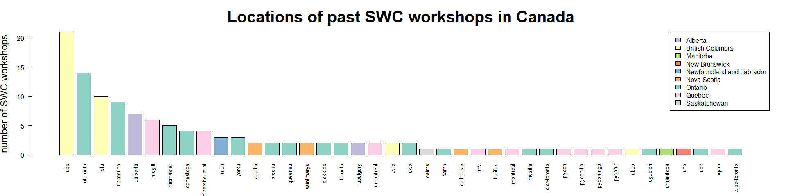
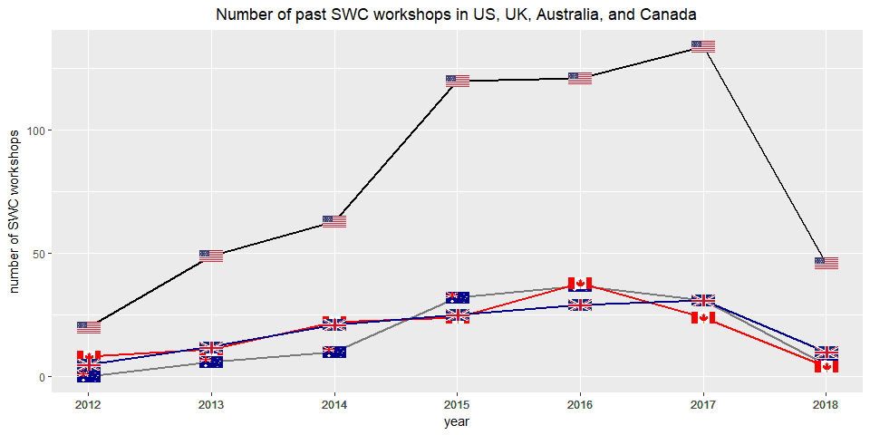
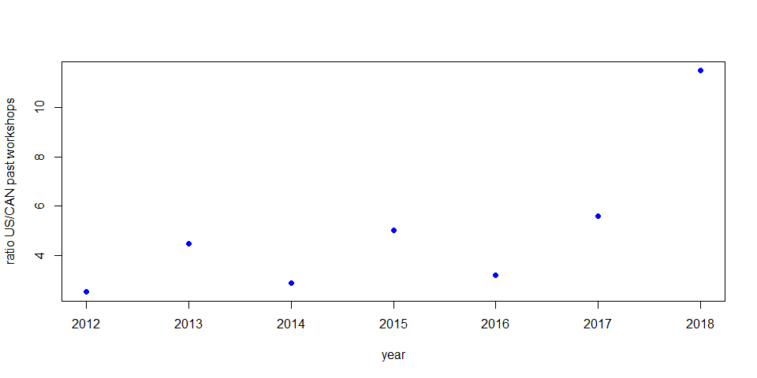

SWC/DC Workshops in Canada
================

Motivation
----------

My goal in joining the Carpentries mentorship group is to help in community building in Canada. In particular, I would like to increase both geographical and institutional diversity of Software Carpentry and Data Carpentry workshops. I thought it might be useful to look at the locations of past workshops.

Preamble
--------

Load libraries and define paths.

``` r
# for data frames
suppressWarnings(suppressMessages(library(dplyr)))

# for making maps
suppressWarnings(suppressMessages(library(maptools)))
suppressWarnings(suppressMessages(library(rgdal)))
suppressWarnings(suppressMessages(library(raster)))
suppressWarnings(suppressMessages(library(maps)))
suppressWarnings(suppressMessages(library(mapdata)))
suppressWarnings(suppressMessages(library(ggmap)))
suppressWarnings(suppressMessages(library(marmap)))
suppressWarnings(suppressMessages(library(lattice)))
suppressWarnings(suppressMessages(library(RColorBrewer)))

# path to the data
pathData <- file.path('..', 'data');
```

Data setup
----------

The first step is to collect the data for all the past Canadian SWC workshop locations. This involves parsing html files. This is kind of embarrassing... I really have to learn more regex! And scraping web files...

The following command partially parses the information from Canadian SWC workshops:

``` shell
grep -A1 "ca.png" ../data/2018-04-17-swc-list.html | grep -P "(20[0-9]{2}-[0-9]{2}-[0-9]{2})" | grep -oP "(20*).*" > ../data/2018-04-19-swc-parsed1.txt
```

Sanity check:

``` shell
grep -A1 "ca.png" ../data/2018-04-17-swc-list.html | grep -P "(20[0-9]{2}-[0-9]{2}-[0-9]{2})" | wc -l
```

There should be 125 workshops.

Read in the partially parsed file.

``` r
temp <- read.csv(
    file = file.path(pathData, '2018-04-19-swc-parsed1.txt'),
    header = FALSE,
    stringsAsFactors = FALSE,
    quote="",
    sep="/"
);

# sanity checks
print(nrow(temp))
```

    ## [1] 125

``` r
print(head(temp))
```

    ##                      V1                                     V2  V3  V4
    ## 1 2018-03-14-SFU-python             ">Simon Fraser University< a>< td>
    ## 2        2018-03-12-mun ">Memorial University of Newfoundland< a>< td>
    ## 3  2018-03-03-conestoga                   ">Conestoga College< a>< td>
    ## 4   2018-01-18-utoronto               ">University of Toronto< a>< td>
    ## 5     2017-12-12-acadia                   ">Acadia University< a>< td>
    ## 6        2017-12-02-mun                 ">Memorial University< a>< td>

Collect all the data in a dataframe.

``` r
swc <- data.frame(matrix(, nrow=nrow(temp), ncol=0))
swc$code <- tolower(substring(temp$V1, 12))
swc$year <- substr(temp$V1, 1, 4)
swc$month <- substr(temp$V1, 6,7)
swc$day <- substr(temp$V1, 9,10)
swc$location <- gsub("<", "", gsub('">',"", temp$V2))
```

Clean up some of the redundancies in "code" field. This is done one manually (hence boring code).

``` r
swc$simpleCode <- swc$code;
swc$simpleCode <- gsub("swc-", "", swc$simpleCode)
swc$simpleCode <- gsub("-python", "", swc$simpleCode)
swc$simpleCode[26] <- "uvic";
swc$simpleCode <- gsub("york-university", "yorku", swc$simpleCode)
swc$simpleCode <- gsub("lsiubc", "ubc", swc$simpleCode)
swc$simpleCode <- gsub("^waterloo", "uwaterloo", swc$simpleCode)
swc$simpleCode <- gsub("^alberta", "ualberta", swc$simpleCode)
swc$simpleCode <- gsub("^westernu", "uwo", swc$simpleCode)
swc$simpleCode <- gsub("smu", "saintmarys", swc$simpleCode)
swc$simpleCode[grep("University of Toronto", swc$location)] <- "utoronto";
swc$simpleCode[grep("University of Calgary", swc$location)] <- "ucalgary";
swc$simpleCode[grep("Queen", swc$location)] <- "queensu";
```

Include province information. Again, this is also done manually.

``` r
swc$province <- NA;
swc$province[swc$simpleCode %in% c("ubc", "ubco", "sfu", "uvic")] <- "British Columbia";
swc$province[swc$simpleCode %in% c("queensu", "utoronto", "toronto", "yorku", "mcmaster", "uwaterloo", "uoit", "brocku", "camh", "conestoga", "uguelph", "uwo", "sickkids", "wise-toronto", "oicr-toronto", "mozilla")] <- "Ontario";
swc$province[swc$simpleCode %in% c("mcgill", "uqam", "universite-laval", "umontreal", "montreal", "fmv")] <- "Quebec";
swc$province[grep("pycon", swc$simpleCode)] <- "Quebec";
swc$province[swc$simpleCode %in% c("mun")] <- "Newfoundland and Labrador";
swc$province[swc$simpleCode %in% c("halifax", "dalhousie", "acadia", "saintmarys")] <- "Nova Scotia";
swc$province[swc$simpleCode %in% c("ualberta", "ucalgary")] <- "Alberta";
swc$province[swc$simpleCode %in% c("umanitoba")] <- "Manitoba";
swc$province[swc$simpleCode %in% c("unb")] <- "New Brunswick";
swc$province[swc$simpleCode %in% c("caims")] <- "Saskatchewan";
```

Visualize SWC locations in Canada
---------------------------------

### Bar plot of most common location codes

First, find the most common locations for SWC workshops. Summarize the number of different codes in the data frame `swc`, and group them by province as well.

``` r
# find the number of SWC workshops per code
codeCounts <- swc %>% group_by(simpleCode, province) %>% summarise( n=n()) %>% ungroup() %>% arrange(-n)
```

    ## Warning: package 'bindrcpp' was built under R version 3.4.4

``` r
print(codeCounts)
```

    ## # A tibble: 40 x 3
    ##    simpleCode       province                      n
    ##    <chr>            <chr>                     <int>
    ##  1 ubc              British Columbia             21
    ##  2 utoronto         Ontario                      14
    ##  3 sfu              British Columbia             10
    ##  4 uwaterloo        Ontario                       9
    ##  5 ualberta         Alberta                       7
    ##  6 mcgill           Quebec                        6
    ##  7 mcmaster         Ontario                       5
    ##  8 conestoga        Ontario                       4
    ##  9 universite-laval Quebec                        4
    ## 10 mun              Newfoundland and Labrador     3
    ## # ... with 30 more rows

Create a bar plot of the location codes, coloured by the province. The code is messy again, since wanted to manually adjust the colour order.

``` r
# trying to make the colours nicer
provColours <- brewer.pal(n = 12, name = "Set3")[c(3,2,7,4,5,6,1,8,9,10)]
provColours <- provColours[as.numeric(as.factor(codeCounts$province))]
barplot(codeCounts$n, names.arg=codeCounts$simpleCode, col=provColours, cex.names=1,las=2)
```



### Map of Canada and SWC frequencies

In the next step, create a map of Canada, were each province is coloured by the number of past SWC workshops which have occured there. First, summarize the data frame `swc` by provinces.

``` r
# find the number of SWC workshops per province
provinceCounts <- swc %>% group_by(province) %>% summarise(n=n()) %>% ungroup() %>% arrange(-n)
print(provinceCounts)
```

    ## # A tibble: 9 x 2
    ##   province                      n
    ##   <chr>                     <int>
    ## 1 Ontario                      51
    ## 2 British Columbia             34
    ## 3 Quebec                       19
    ## 4 Alberta                       9
    ## 5 Nova Scotia                   6
    ## 6 Newfoundland and Labrador     3
    ## 7 Manitoba                      1
    ## 8 New Brunswick                 1
    ## 9 Saskatchewan                  1

Start setting up the plotting information by defining the colour palette and getting the map data.

``` r
# create colour gradient
colfunc <- colorRampPalette(c("yellow","red"))
colVals <- colfunc(max(provinceCounts$n));
colInd <- provinceCounts$n;

# get the map of Canada
Canada <- getData('GADM', country="CAN", level=1)
```

The province of Quebec has an accent on the 'e' in `NAME_1`, so need to match the map and `swc` data frame data manually.

``` r
# match the province names in the table with the
provInd <- match(provinceCounts$province, Canada$NAME_1);
provInd[is.na(provInd)] <- 13;
```

Colour provinces in the map of Canada by how many SWC workshops have occurred there.

``` r
# Very pretty code from: https://stackoverflow.com/questions/10763421/r-creating-a-map-of-selected-canadian-provinces-and-u-s-states?utm_medium=organic&utm_source=google_rich_qa&utm_campaign=google_rich_qa

# Specify a geographic extent for the map
# by defining the top-left and bottom-right geographic coordinates
mapExtent <- rbind(c(-156, 80), c(-68, 19))

# Specify the required projection using a proj4 string
# Use http://www.spatialreference.org/ to find the required string
# Polyconic for North America
newProj <- CRS("+proj=poly +lat_0=0 +lon_0=-100 +x_0=0 
            +y_0=0 +ellps=WGS84 +datum=WGS84 +units=m +no_defs")

## Project the map extent (first need to specify that it is longlat) 
mapExtentPr <- spTransform(SpatialPoints(mapExtent, 
                  proj4string=CRS("+proj=longlat")),
                  newProj)

can1Pr <- spTransform(Canada, newProj)
plot(mapExtentPr, pch=NA)
plot(can1Pr, border="black", col="lightgrey", add=TRUE)

# loop over the provinces, colouring them according to the number of 
# workshops that have occured there
for (jj in 1:length(colInd)){
  plot(can1Pr[provInd[jj],], border="black", col=colVals[colInd[jj]], add=TRUE)
}
legend('topleft', legend=c(1,NA,10,NA,20,NA,30,NA,40,NA,50), fill=colVals[c(1,seq(5, 50, 5))], bty="n", x.intersp = 2, y.intersp = .5)
```


Comparison with US and UK
-------------------------

``` r
data = read.csv("countryCounts.txt", header=FALSE)
colnames(data) = c("location", "year", "count");
data$location = gsub(".png", "", data$location);

usData = data[data$location=="us",];
caData = data[data$location=="ca",];
gbData = data[data$location=="gb",];

plot(usData$year, usData$count, col="blue", pch=19, ylab="number SWC workshops", xlab="year", ylim=c(-5, 140))
points(gbData$year, gbData$count, col="green", pch=15)
points(caData$year, caData$count, col="red", pch=17)
legend('topleft', c("US", "CAN", "UK"), col = c("blue", "red", "green"), pch=c(19, 17, 15))
```



``` r
ratioCounts = usData$count/caData$count
plot(usData$year, ratioCounts, col="blue", pch=19, ylab="ratio US/CAN past workshops", xlab="year")
```


